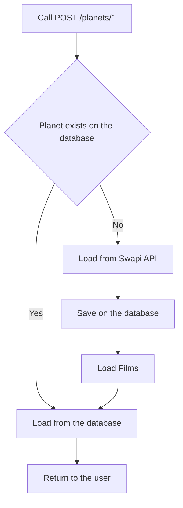
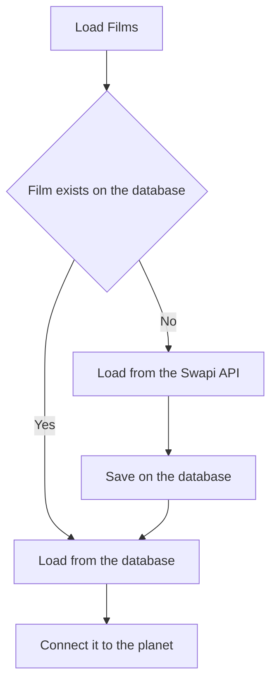

# Star Wars Java API

## Introduction

This is a Java API that deliveries information about the Star Wars planets. It consumes data from
the [Star Wars API](https://swapi.co/).

## Architecture

This api store and serve data from the Star Wars API. It is developed using Spring Boot and Java 17.

### Packages

The structure of the project is the following:

- **adapter**: Contains the input points to the project.
    - **http**: Contains the controllers and the models.
- **application**: Contains the necessary classes to implement the business logic.
- **configuration**: Contains the configuration classes.
- **gateway**: Contains the classes that are used to consume data from external sources.
    - **api**: Contains the classes to consume the Star Wars API.
    - **database**: Contains the classes that are used to interact with the database.

### Configuration

The configuration of the project is done using the application-{profile}.yaml file. The following properties are
available:

- **swapi**: Contains the configuration of the Star Wars API.
    - **url**: The url of the Star Wars API.
- **spring**: Contains the configuration for the spring api.
    - ** r2dbc**: Contains the configuration for the database.
        - **url**: The url of the database.
        - **username**: The username of the database.
        - **password**: The password of the database.

The default configuration can be found in the application.yaml file.

It connects to the database in the `localhost`postgres server in the `star_wars` database, user `root` and
password `postgres`.

It uses the https://swapi.co/api Star Wars API.

### How it works

These are the application endpoints:

- **GET /planets**: Returns a list of all the planets in the database.
    - request: `curl -X GET http://localhost:8080/planets`
    - response:
  ```json
  [
    {
      "id": 1,
      "name": "Tatooine",
      "climate": "arid",
      "terrain": "desert",
      "films": [
        {
          "id": 4,
          "title": "The Phantom Menace",
          "director": "George Lucas",
          "releaseDate": "1999-05-19"
        },
        {
          "id": 5,
          "title": "Attack of the Clones",
          "director": "George Lucas",
          "releaseDate": "2002-05-16"
        },
        {
          "id": 3,
          "title": "Return of the Jedi",
          "director": "Richard Marquand",
          "releaseDate": "1983-05-25"
        },
        {
          "id": 6,
          "title": "Revenge of the Sith",
          "director": "George Lucas",
          "releaseDate": "2005-05-19"
        },
        {
          "id": 1,
          "title": "A New Hope",
          "director": "George Lucas",
          "releaseDate": "1977-05-25"
        }
      ]
    }
  ]
  ```
- **GET /planets?search=<name>**: Returns a list of all the planets filtered by the name.
    - request: `curl -X GET http://localhost:8080/planets?search=Tatooine`
    - response:
  ```json
  [
    {
      "id": 1,
      "name": "Tatooine",
      "climate": "arid",
      "terrain": "desert",
      "films": [
        {
          "id": 4,
          "title": "The Phantom Menace",
          "director": "George Lucas",
          "releaseDate": "1999-05-19"
        },
        {
          "id": 5,
          "title": "Attack of the Clones",
          "director": "George Lucas",
          "releaseDate": "2002-05-16"
        },
        {
          "id": 3,
          "title": "Return of the Jedi",
          "director": "Richard Marquand",
          "releaseDate": "1983-05-25"
        },
        {
          "id": 6,
          "title": "Revenge of the Sith",
          "director": "George Lucas",
          "releaseDate": "2005-05-19"
        },
        {
          "id": 1,
          "title": "A New Hope",
          "director": "George Lucas",
          "releaseDate": "1977-05-25"
        }
      ]
    }
  ]
  ```
- **GET /planets/{id}**: Returns the planet with the given id.
    - request: `curl -X GET http://localhost:8080/planets/1`
    - response:
  ```json
  {
    "id": 1,
    "name": "Tatooine",
    "climate": "arid",
    "terrain": "desert",
    "films": [
      {
        "id": 4,
        "title": "The Phantom Menace",
        "director": "George Lucas",
        "releaseDate": "1999-05-19"
      },
      {
        "id": 5,
        "title": "Attack of the Clones",
        "director": "George Lucas",
        "releaseDate": "2002-05-16"
      },
      {
        "id": 3,
        "title": "Return of the Jedi",
        "director": "Richard Marquand",
        "releaseDate": "1983-05-25"
      },
      {
        "id": 6,
        "title": "Revenge of the Sith",
        "director": "George Lucas",
        "releaseDate": "2005-05-19"
      },
      {
        "id": 1,
        "title": "A New Hope",
        "director": "George Lucas",
        "releaseDate": "1977-05-25"
      }
    ]
  }
  ```
- **POST /planets/{id}**: Loads a planet from the Swapi API in the database and returns it.
    - request: `curl -X POST http://localhost:8080/planets/1`
    - response:
  ```json
  {
    "id": 1,
    "name": "Tatooine",
    "climate": "arid",
    "terrain": "desert",
    "films": [
      {
        "id": 4,
        "title": "The Phantom Menace",
        "director": "George Lucas",
        "releaseDate": "1999-05-19"
      },
      {
        "id": 5,
        "title": "Attack of the Clones",
        "director": "George Lucas",
        "releaseDate": "2002-05-16"
      },
      {
        "id": 3,
        "title": "Return of the Jedi",
        "director": "Richard Marquand",
        "releaseDate": "1983-05-25"
      },
      {
        "id": 6,
        "title": "Revenge of the Sith",
        "director": "George Lucas",
        "releaseDate": "2005-05-19"
      },
      {
        "id": 1,
        "title": "A New Hope",
        "director": "George Lucas",
        "releaseDate": "1977-05-25"
      }
    ]
  }
  ```
- **DELETE /planets/{id}**: Deletes the planet with the given id.
    - request: `curl -X DELETE http://localhost:8080/planets/1`
    - response: `204 No Content`

#### POST /planets/{id}

The load planets works in the following way:



#### Load Films

The load films works in the following way:



## How to use

### How to test

To run the tests, you can use the following command:

```bash
make test
```

The test will generate a coverage report in the `build/reports/jacoco/test/html/index.html` folder.

### How to build

To build the API, you can use the following command:

```bash
make build
```

It will create a docker image with the name `star-wars-api`. To run that image you should export the database
connections variables:

```bash
export DATABASE_URL=<database_url>;
export DATABASE_USERNAME=<database_username>;
export DATABASE_PASSWORD=<database_password>;
```

Then, you can use the following command:

```bash
docker run -p 8080:8080 -e DATABASE_URL -e DATABASE_USER -e DATABASE_PASSWORD star-wars-api
```

### How to run

#### Using local machine

To run the API you need java 17 installed. You can download
it [here](https://www.oracle.com/java/technologies/downloads/#java17).

And you need to have a local instance of PostgreSQL running. You can download
it [here](https://www.postgresql.org/download/). With an instance running, you need an user called `root` with
password `postgres` with access to a database called `star_wars`.

After that, you can run the API using the following command:

```bash
make run
```

#### Using Docker

To run the API using Docker, you need to have Docker installed. You can download
it [here](https://docs.docker.com/get-docker/).

After that, you can run the API using the following command:

```bash
make docker-run
```

Once running the API, you can the openapi definition of the api in this [link](http://localhost:8080/openapi)
and the Swagger documentation for the API in this [link](http://localhost:8080/swagger-ui).
